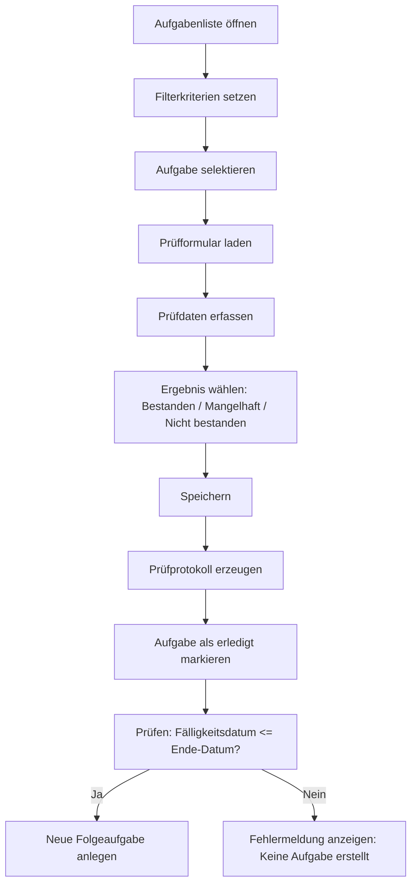
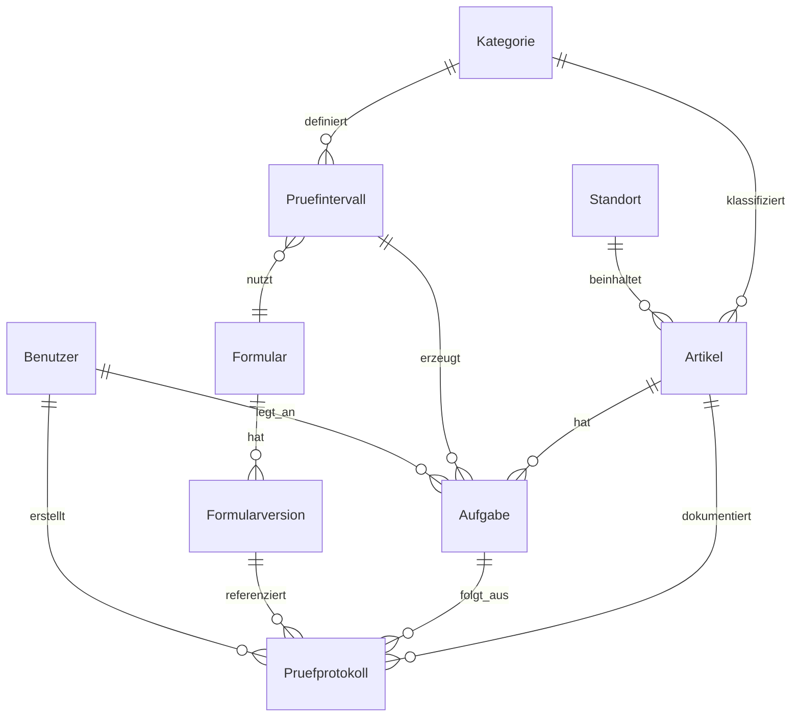

# Assert Manager

## Inhaltsverzeichnis
- [Assert Manager](#assert-manager)
  - [Inhaltsverzeichnis](#inhaltsverzeichnis)
  - [Ziel des Dokuments](#ziel-des-dokuments)
  - [Übersicht](#übersicht)
  - [Zielgruppe](#zielgruppe)
  - [Anwendungsbeispiele](#anwendungsbeispiele)
    - [Beispiel 1: Atemschutzgerät PSS 5000](#beispiel-1-atemschutzgerät-pss-5000)
    - [Beispiel 2: Leiter](#beispiel-2-leiter)
  - [Funktionen des Systems](#funktionen-des-systems)
- [Stammdaten](#stammdaten)
  - [Benutzer](#benutzer)
  - [Standorte](#standorte)
  - [Kategorien und Intervalle](#kategorien-und-intervalle)
  - [Formulare](#formulare)
- [Artikelstammdaten](#artikelstammdaten)
  - [Ungeplante manuelle Prüfung (Artikel)](#ungeplante-manuelle-prüfung-artikel)
- [Aufgabenverwaltung und Prüfungen](#aufgabenverwaltung-und-prüfungen)
    - [Reviewer-Workflow](#reviewer-workflow)
- [Prüfprotokolle](#prüfprotokolle)
- [Übersichten und Bedienung](#übersichten-und-bedienung)
- [Navigation / Seitenstruktur](#navigation--seitenstruktur)
- [Technisches Konzept](#technisches-konzept)
  - [Zielumgebung](#zielumgebung)
  - [Architektur](#architektur)
  - [Datenmodell](#datenmodell)
    - [Entitätsbeziehungen](#entitätsbeziehungen)
  - [Formular- und Versionierungslogik](#formular--und-versionierungslogik)
  - [Aufgabenfluss](#aufgabenfluss)
  - [Barcode-Workflow](#barcode-workflow)
  - [Export](#export)
  - [Sicherheits- und Betriebsanforderungen](#sicherheits--und-betriebsanforderungen)
  - [Offene Punkte für die Gerätewarte](#offene-punkte-für-die-gerätewarte)
  - [Anmerkung](#anmerkung)

## Ziel des Dokuments
Dieses Dokument beschreibt die Anforderungen an eine zentrale Webanwendung zur Verwaltung von Geräten, Prüfungen und Standorten. Es richtet sich an die Gerätewarte und Prüfverantwortlichen, die später mit dem System arbeiten. Ziel ist es, den betriebsüblichen Prüfprozess abzubilden, vorhandene Arbeitsabläufe zu vereinfachen und alle notwendigen Informationen strukturiert in einer Datenbank zu speichern.

## Übersicht
Die Anwendung ermöglicht die zentrale Pflege aller Geräte und Zubehörteile, die in der Feuerwehr und Werkstatt regelmäßig geprüft werden müssen. Jedes Gerät wird in einer zentralen Datenbank verwaltet, erhält einen Lagerort und wird mit wiederkehrenden Prüfaufgaben verknüpft. Prüfer können die Prüfungen im System dokumentieren, Abschlussbewertungen festhalten und frühere Protokolle nachvollziehen.

## Zielgruppe
- Gerätewarte
- Werkstattpersonal
- Inventarisierer

## Anwendungsbeispiele
### Beispiel 1: Atemschutzgerät PSS 5000
Ein Atemschutzgerät wird als Artikel angelegt mit folgenden Informationen:
- Hersteller: Dräger
- Typ: PSS 5000
- Seriennummer: 12345
- Anschaffungsdatum: 01.04.2024
- Barcode: ASG-001
- Standort: Fahrzeug 46 HLF > Atemschutzkabine
- Kategorie: Atemschutz.PSS500

Für diese Kategorie werden mehrere Prüfintervalle definiert:
- Regelwartung alle 6 Monate
- Tausch Ausatemventil alle 72 Monate
- Tausch Membran alle 72 Monate
- Prüfung nach jeder Benutzung (Einsatz/Übung)

Jede dieser Prüfungen hat ein eigenes Prüfformular mit spezifischen Feldern.

### Beispiel 2: Leiter
Leitern werden als Artikel eingepflegt mit folgenden Angaben:
- Hersteller: Zarges
- Typ: Steckleiter 3-teilig
- Inventarnummer: LDR-023
- Barcode: LDR-023
- Standort: Werkstatt > Gerätelager
- Kategorie: Leiter

Für Leitern gilt:
- Regelwartung 12 Monate
- Spezielle Messwerte werden erfasst und mit der letzten Prüfung verglichen
- Wird der Wert zu stark abweichen, wird der Prüfstatus auf "Mangel" gesetzt

## Funktionen des Systems
- Zentrale Artikelverwaltung
- Manuelle und automatische Aufgabenanlage
- Dynamische Prüf- und Formularverwaltung
- Lagerortverwaltung mit Hierarchie
- Transparente Prüfprotokolle und Historie
- Filterbare Übersichten für Artikel, Aufgaben und Protokolle
- Barcode-Unterstützung für schnelle Suche und Umlagerung

# Stammdaten
Die Stammdaten sind die Grundlage aller Prüfungen und Aufgaben.

## Benutzer
Das System bietet eine einfache Benutzerverwaltung zur Anmeldung am Webportal.

Feldinhalte:
- Vorname
- Nachname
- E-Mail
- Passwort

Hinweis: Ein initialer Administrator wird einmalig beim Systemstart oder bei der Installation angelegt. Für den produktiven Einsatz wird ein eigenes Passwort gesetzt.

## Standorte
Standorte werden in einer hierarchischen Struktur gehalten, damit Geräte eindeutig zugeordnet werden können. Jeder Standort kann einen übergeordneten Standort haben.

Feldinhalte:
- Name
- Beschreibung
- Barcode
- Icon (z. B. Verzeichnis, LKW, Regal, Raum)
- Übergeordneter Standort

Beispiele:
- Fahrzeug > 46 HLF > Kabine
- Werkstatt > Atemschutz
- Trolley CSA
- Einsatzkraft > René Befort
- Außer Haus > Giebler

## Kategorien und Intervalle
Jeder Artikel gehört zu einer Kategorie. Kategorien beschreiben die Art des Gerätes und definieren die Prüfintervalle.

Hinweis: Formulare und Kategorien sind völlig frei konfigurierbar. Die Leiter ist hier nur ein Beispiel für einen Prüfprozess.

Feldinhalte Kategorie:
- Name
- Beschreibung
- Aktiv/Inaktiv

Für jede Kategorie können mehrere Prüfintervalle angelegt werden.

Feldinhalte Intervall:
- Name des Intervalls
- Rhythmus in Monaten
- Referenz auf ein Formular
- Aktiv/Inaktiv

Beispiel:
- Kategorie: Atemschutz.PSS500
  - Intervall: Regelwartung alle 6 Monate
  - Intervall: Tausch Ausatemventil alle 72 Monate

## Formulare
Formulare definieren, welche Angaben bei einer Prüfung erfasst werden müssen. Sie werden dynamisch erstellt, damit alle Prüfarten abgedeckt werden können.

Feldarten pro Formularfeld:
- Ja/Nein
- Singleline-Text
- Ganzzahl
- Gleitkommazahl (2 Nachkommastellen)
- Mehrzeiliger Text
- Optional: Referenzwert/Einheit

Jedes Formular enthält:
- Name
- Beschreibung
- Status (aktiv, inaktiv)
- Erstellungsdatum
- Letzte Änderung / Editor
- Sortierreihenfolge der Felder
- Automatisch ein abschließendes Prüfergebnis (Bestanden, Mangelhaft, Nicht bestanden)
- Optional: Anzeige der Werte aus der letzten Prüfung

Beim Erfassen eines Prüfformulars kann der Anwender über einen einblendbaren Schalter/Slider die Anzeige der letzten Prüfwerte aktivieren. Die vorherigen Werte werden jeweils unterhalb des aktuellen Eingabefelds in geänderter Schrift angezeigt, damit der neue Wert direkt mit dem letzten Prüfwert verglichen werden kann.

Beispiele für Formulare:
- Atemschutz PSS Regelwartung
  - Sichtkontrolle (Ja/Nein)
  - Druck der Restdruckwarneinrichtung (Bar)
  - Dichtigkeit geprüft (Ja/Nein)
  - Funktionstest bestanden (Ja/Nein)
  - Finales Prüfergebnis (Bestanden / Mangelhaft / Nicht bestanden)

- Atemschutz PSS Tausch-Ausatemventil
  - Seriennummer des neuen Ventils (Text)
  - Einbaudatum (Datum)
  - Endgültiges Prüfergebnis (Bestanden / Mangelhaft / Nicht bestanden)

- Leiterprüfung
  - Durchbiegung in cm (Gleitkommazahl)
  - Sichtkontrolle (Ja/Nein)
  - Vergleich zum letzten Messwert (Automatisch)
  - Endgültiges Prüfergebnis (Bestanden / Mangelhaft / Nicht bestanden)

Formular-Versionierung:
- Jede Änderung an einem Formular erzeugt eine neue Version
- Alte Prüfprotokolle behalten die ursprüngliche Version bei
- So bleiben frühere Prüfungen nachvollziehbar und konsistent

# Artikelstammdaten
In den Artikelstammdaten werden die einzelnen Geräte oder Gerätegruppen angelegt.

Feldinhalte Artikel:
- Identifikation / Name
- Hersteller
- Typ / Modell
- Seriennummer
- Herstellernummer
- Inventarnummer
- Barcode
- Anschaffungsdatum
- Datum der Produktion
- Datum der Ausmusterung
- Rechtsgrundlage
- Ende-Datum
- Beschreibung
- Kategorie
- Standort
- Status (aktiv/inaktiv)
- Erstellungsdatum
- Änderungsdatum
- Ersteller
- Letzter Bearbeiter

Beispiel Artikel:
- Identifikation: Atemschutzgerät PSS 5000
- Hersteller: Dräger
- Typ: PSS 5000
- Seriennummer: 12345
- Barcode: ASG-001
- Kategorie: Atemschutz.PSS500
- Standort: Fahrzeug 46 HLF > Kabine
 
## Ungeplante manuelle Prüfung (Artikel)
Zusätzlich zur normalen Aufgabenverwaltung soll es in der Artikelansicht die Möglichkeit geben, eine ungeplante manuelle Prüfung direkt am Artikel zu erfassen (z. B. "Waschen nach dem Einsatz" mit entsprechender Sichtkontrolle).
- Die Erfassung erzeugt ein Prüfprotokoll mit den eingegebenen Formularfeldern.
- Diese Erfassung wirkt sich nicht auf bereits existierende Aufgaben aus: Es werden keine Aufgaben verändert, verschoben oder neu angelegt.
- Die ungeplante Prüfung ist vor allem für kurzfristige Kontrollen oder einsatzbedingte Maßnahmen gedacht.

# Aufgabenverwaltung und Prüfungen
Die Aufgabenverwaltung sorgt dafür, dass Prüfungen zum richtigen Zeitpunkt vorhanden sind.

Automatische Aufgabenanlage:
- Beim Anlegen eines Artikels werden für alle hinterlegten Intervalle der Kategorie Aufgaben erzeugt
- Das erste Fälligkeitsdatum wird aus dem Anschaffungsdatum berechnet
- Jede Aufgabe verweist auf ein Prüfformular
- Wichtige Validierungsregel: Falls das berechnete Fälligkeitsdatum größer ist als das `Ende-Datum` des Artikels, wird für dieses Intervall keine Aufgabe angelegt. In diesem Fall erhält der Anwender eine Meldung (z. B. "Keine Aufgabe erstellt: Fälligkeitsdatum liegt nach dem Ende-Datum des Artikels").

Aufgabenstatus:
- Neu
- In Bearbeitung
- Erledigt

Workflow:
1. Der Gerätewart öffnet die Aufgabenliste.
2. Er wählt eine Aufgabe aus.
3. Vor der Ausführung kann das Fälligkeitsdatum der Aufgabe bearbeitet werden (z. B. Verschiebung oder Korrektur).
4. Das zugeordnete Prüfformular wird geladen.
5. Er erfasst die vorgegebenen Werte. Bei Bedarf zeigt ein Slider die Werte der letzten Prüfung unterhalb der Eingabefelder in geänderter Schrift an.
6. Am Ende wählt er "Bestanden", "Mangelhaft" oder "Nicht bestanden".
6. Nach dem Speichern wird ein Prüfprotokoll erstellt und die Aufgabe als "Erledigt" markiert.
7. Bei erledigen Aufgaben wird automatisch eine Folgeaufgabe mit neuem Fälligkeitsdatum angelegt.

Manuelle Aufgabe:
- Für Sonderprüfungen oder zusätzliche Kontrolle kann eine Aufgabe manuell angelegt werden
- Formular und Fälligkeitsdatum werden manuell festgelegt
- Das Fälligkeitsdatum einer bestehenden Aufgabe ist jederzeit änderbar (z. B. zur Verschiebung oder Korrektur).

### Reviewer-Workflow

# Prüfprotokolle
Jede abgearbeitete Aufgabe erzeugt ein Prüfprotokoll.

Protokollinformationen:
- Zugehöriger Artikel
- Zugehörige Aufgabe
- Formularversion
- Erfasste Daten
- Abschlussbewertung / Prüfergebnis (Bestanden / Mangelhaft / Nicht bestanden)
- Zusatzbemerkungen
- Erstellungsdatum
- Ersteller

Wichtig:
- Protokolle sind in der Historie archiviert
- Alte Prüfungen bleiben lesbar
- Der zuletzt erfasste Prüfstatus eines Protokolls wird als aktueller Prüfstatus am Artikel angezeigt

# Übersichten und Bedienung
Die Anwendung bietet verschiedene Übersichtsseiten für den täglichen Betrieb.

Artikelstamm:
- Anzeige aller Artikel mit allen relevanten Spalten
- Filter pro Spalte
- Barcode-Suchfeld zur schnellen Artikelauswahl
- Aufruf einzelner Artikel für Detailansicht und Bearbeitung

Standortwechsel:
- Barcode eines Artikels scannen
- Barcode des neuen Standorts scannen
- Standort des Artikels wird aktualisiert

Aufgabenliste:
- Alle offenen Aufgaben mit Artikel, Kategorie und Standort
- Sortiert nach Fälligkeitsdatum
- Mehrfachselektion möglich für gleichartige Prüfungen
- Direkter Einstieg in das Prüfformular
Aufgabenliste (Grid-Ansicht)
- Grid mit einer Zeile pro Aufgabe; die folgenden Spalten werden angezeigt (aus dem zugeordneten Artikel bzw. der Aufgabe):
  - Artikel: Identifikation
  - Artikel: Barcode
  - Artikel: Inventarnummer
  - Kategorie
  - Standort
  - Name des Intervalls
  - Name des Formulars
  - Ende-Datum (Artikel)
- Spalten sind per Drag & Drop verschiebbar, so dass Anwender die Anzeige ihren Präferenzen anpassen können.
- Jede Spalte bietet einen eigenen Filter (z. B. Textsuche, Auswahl, Datumsauswahl). Filterszenario: Anzeige aller Aufgaben der Kategorie "Atemschutz.PSS500", mit Fälligkeitsdatum in diesem Monat, Intervall = "Regelwartung (6 Monate)" und Standort enthält "Fahrzeug 46 HLF".
- Sortierung standardmäßig nach Fälligkeitsdatum, aber über Spaltenkopf änderbar.
- Mehrfachselektion möglich; markierte Aufgaben können gesammelt als Stapel abgearbeitet werden.
- Direktes Öffnen des zugeordneten Prüfformulars durch Doppelklick oder Aktionsbutton in der Zeile.

Protokollübersicht:
- Liste aller gespeicherten Prüfprotokolle
- Filter nach Artikel, Kategorie, Status und Zeitraum
- Read-only Ansicht für einzelne Protokolle

# Navigation / Seitenstruktur
Die linke Navigation ist in Hauptbereiche unterteilt. Die wichtigsten Funktionen sind dort jeweils auf der jeweiligen Übersichtsseite verfügbar.

- Dashboard
  - Übersicht der fälligen Aufgaben
  - Aktuelle Prüfstatus-Übersicht
  - Kurzstatistiken zu Artikeln, Aufgaben und Protokollen
- Stammdaten
  - Benutzer
  - Standorte
  - Kategorien & Intervalle
  - Formulare
- Artikelstamm
  - Artikelliste
  - Funktionen auf der Artikelliste:
    - Artikel anlegen
    - Artikel bearbeiten
    - Standortwechsel
- Aufgaben
  - Aufgabenliste
  - Funktionen auf der Aufgabenliste:
    - Aufgabe ausführen
    - Manuelle Aufgabe anlegen
- Protokolle
  - Prüfprotokolle-Liste
  - Funktion auf der Protokollliste:
    - Protokoll-Detail öffnen
- Export
  - Inventarliste exportieren
  - optional: Prüfprotokoll exportieren

Hinweise zur Navigation:
- Die Funktionen "Aufgabe ausführen" und "Manuelle Aufgabe anlegen" werden auf der Seite Aufgabenliste angeboten.
- Die Funktionen "Artikel anlegen" und "Artikel bearbeiten" werden auf der Seite Artikelliste angeboten.
- Für Prüfprotokolle gibt es eine Liste, aus der einzelne Protokolle per Klick in die Detailansicht geöffnet werden.

# Technisches Konzept
Dieses Kapitel beschreibt die technische Umsetzung der Anwendung. Es dient als Grundlage für die Entwickler und gibt einen Überblick über Architektur, Datenmodell und Systemverhalten.

## Zielumgebung
- Zentraler Server mit mehreren Clients
- Bis zu 3 gleichzeitige Nutzer
- Keine Offline-Funktionalität erforderlich
- Keine Benachrichtigungen im MVP
- Backup über Datenbank-Sicherung (z. B. regelmäßige DB-Dumps)
- Keine Mehrsprachigkeit geplant

## Architektur
- Webanwendung auf Basis von .NET
- Blazor-Frontend (empfohlen: Blazor Server)
- Zentrale relationale Datenbank (empfohlen: PostgreSQL oder SQLite für den MVP)
- Einfache Benutzerverwaltung mit Passwort-Hashing

## Datenmodell
Kern-Entitäten:
- Benutzer
- Standorte
- Kategorien
- Prüfintervalle
- Formulare und Formularversionen
- Artikel
  - Identifikation / Name
  - Hersteller
  - Typ / Modell
  - Seriennummer
  - Herstellernummer
  - Inventarnummer
  - Barcode
  - Anschaffungsdatum
  - Datum der Produktion
  - Datum der Ausmusterung
  - Rechtsgrundlage
  - Ende-Datum
  - Beschreibung
  - Kategorie
  - Standort
  - Status
- Aufgaben
- Prüfprotokolle

### Entitätsbeziehungen

Wichtige Prinzipien:
- Jeder Datensatz besitzt einen eindeutigen Primärschlüssel
- Formulare sind versioniert, um alte Prüfprotokolle konsistent zu halten
- Kategorien definieren Prüfintervalle und verknüpfen Formulare
- Aufgaben werden aus Kategorien/Intervallen abgeleitet

## Formular- und Versionierungslogik
- Formulare können jederzeit angepasst und erweitert werden
- Jede Änderung erzeugt eine neue Version des Formulars
- Protokolle referenzieren die exakte Formularversion
- So bleibt der Prüfprozess historisch konsistent

## Aufgabenfluss
- Beim Anlage eines Artikels werden Aufgaben für alle aktiven Intervalle der Kategorie erstellt
- Nach Abschluss einer Aufgabe wird automatisch die Folgeaufgabe mit neuem Fälligkeitsdatum erzeugt
- Folgeaufgabe: Fälligkeitsdatum = Erledigt am + Intervall

## Barcode-Workflow
- USB-Scanner wird wie Tastatur verwendet
- Barcode-Eingabe öffnet direkt den entsprechenden Artikel oder Standort
- Umzug eines Artikels erfolgt per Scannen des Artikel-Barcodes und des Zielstandort-Barcodes

## Export
- CSV-Export der Inventarliste
- Filterbar nach Kategorie, Standort, Status
- Späterer Ausbau optional: PDF-Export für Prüfprotokolle

## Sicherheits- und Betriebsanforderungen
- Auch bei simplen Benutzerrollen sollte das Passwort gehasht gespeichert werden
- Admin-Konto wird initial sicher vergeben
- HTTPS empfohlen für produktive Umgebung
- Backups werden als Datenbank-Sicherung außerhalb der Anwendung verwaltet

## Offene Punkte für die Gerätewarte
- Welche Prüfintervalle sollen standardmäßig als Kategorie angelegt werden?
- Welche Formularfelder fehlen für Ihre konkreten Prüfprotokolle?
- Welches Detailniveau braucht es noch?
- Sollen Inventarnummer und Barcode immer getrennt gepflegt werden?
- Welche Zusatzinformationen sollen in den Protokollen speichern (z. B. Bemerkungen, Fotos, Schweißnähte)?

## Anmerkung
Dieses Dokument ist als Arbeitsgrundlage für die Entwicklung gedacht. Bitte prüfen Sie die Beschreibungen und Beispiele, ergänzen Sie fehlende Prüfarten und geben Sie Rückmeldung zu den Formularfeldern und den Intervallen.